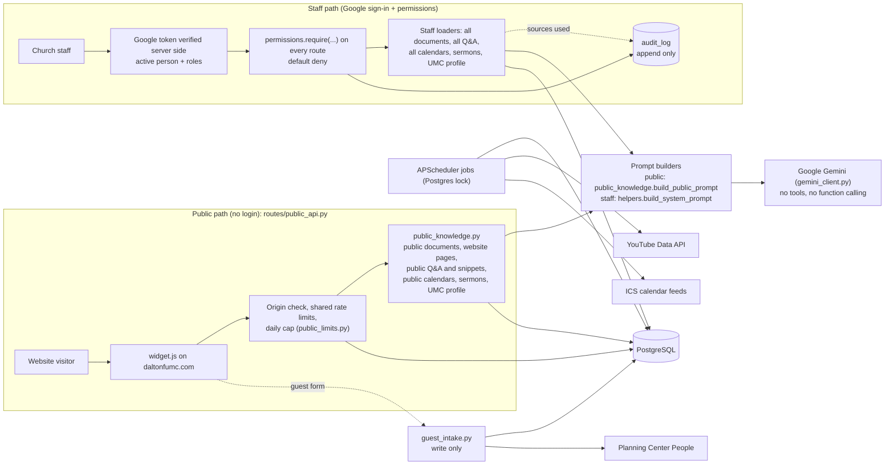
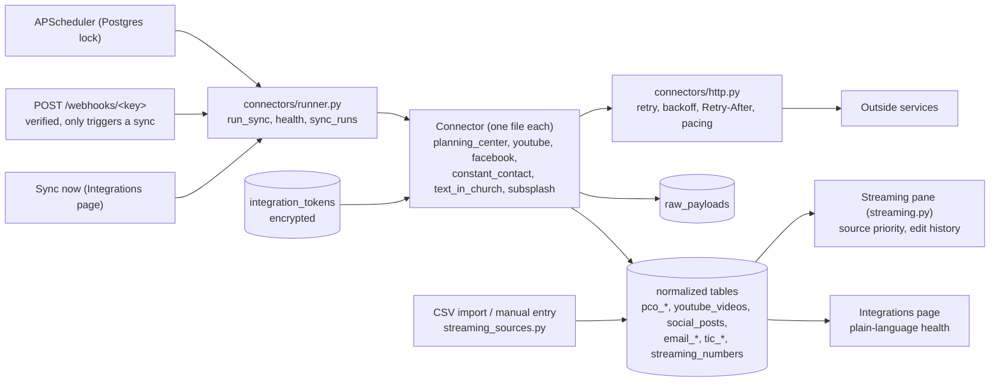

# Architecture

Status after Phase 2 (connector framework and streaming pane, on top of roles, Google sign-in and the
public/staff boundary). Later phases add workflows and role home screens; this file is updated with each.

## Pieces

- **One organization.** `Organization` (table `organization`, one row) holds name, branding,
  timezone, local practice, feature flags. Read it with `organization.get_org()`. There is no
  tenant column anywhere. The row also stores `legacy_widget_id` (2), the id the live website
  embed still sends as `church_id`; the public endpoints accept it and reject any other value.
- **Theology.** Exactly one profile, Wesleyan United Methodist, in `denominations/umc.py`,
  versioned and reviewed separately. There is no selector. The church's own approved practice
  and Q&A outrank the profile in the prompt's authority order.
- **Public and staff paths are separate code, enforced by tests.** The public chatbot is
  `routes/public_api.py` plus `public_knowledge.py`, `public_limits.py` and `gemini_client.py`.
  `public_knowledge.py` has its own queries: it selects `audience="public"` Q&A, snippets and
  calendars and `visibility="staff_and_chatbot"` documents explicitly, so missing data means
  nothing is returned, not everything. `tests/test_public_boundary.py` parses the public
  modules and fails if they import anything outside an allowlist (no staff loader, user model,
  permission or audit code), then plants a secret in every staff store and asks hostile
  questions through the real endpoints. The one write the public path can make into staff
  records is a guest form, through `guest_intake.record_guest`, which returns nothing.
- **Who may do what.** `permissions.py` defines roles, permissions and the default matrix.
  Every non-public route carries `@require(...)`; a test fails if one does not. Admin
  overrides live in `role_permissions`. Sensitive domains are not permissions at all.
- **Audit.** `audit.log_event` writes `audit_log` rows for sign-ins, denied access, role and
  permission changes and each staff AI question (source kinds and titles only).
- **No tools anywhere.** The model is called with function calling disabled. It cannot read a
  table or call an API; it only sees the text the loaders hand it.
- **Scheduler.** Jobs run inside each web worker, wrapped in a Postgres advisory lock so one
  worker runs each job. `WESLEY_DISABLE_SCHEDULER=1` stops it for one-off tooling.
- **Storage.** PostgreSQL in production, SQLite locally. Uploads live on the Railway volume at
  `DATA_DIR/uploads/2/` (the folder name is historical).

## Connectors and the streaming pane (Phase 2)

Each connector follows one interface in `connectors/base.py`. Raw payloads and normalized rows
are separate tables. Tokens are encrypted. Every sync is a row in `sync_runs`. The full
per-tool detail is in [INTEGRATIONS.md](INTEGRATIONS.md). The streaming pane merges numbers
per field by source priority (manual, then CSV, then API) and keeps an edit history.

Known limits are tracked in [AUDIT.md](AUDIT.md).
