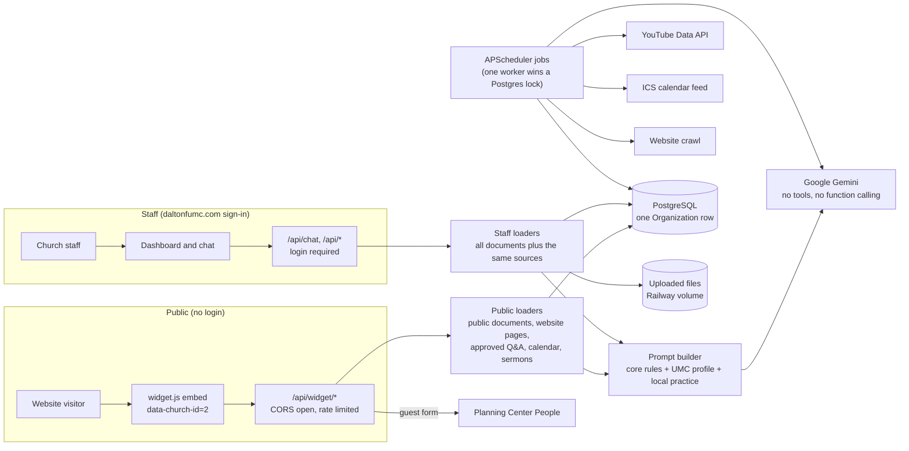

# Architecture

Status after Phase 1 (single organization). Later phases add connectors, roles and the
streaming pane; this file is updated with each.

## Pieces

- **One organization.** `Organization` (table `organization`, one row) holds name, branding,
  timezone, local practice, feature flags. Read it with `organization.get_org()`. There is no
  tenant column anywhere. The row also stores `legacy_widget_id` (2), the id the live website
  embed still sends as `church_id`; the public endpoints accept it and reject any other value.
- **Theology.** Exactly one profile, Wesleyan United Methodist, in `denominations/umc.py`,
  versioned and reviewed separately. There is no selector. The church's own approved practice
  and Q&A outrank the profile in the prompt's authority order.
- **Public and staff paths** share the prompt builder and source loaders but differ in what
  they load: the public path calls `load_chatbot_documents` (documents marked
  `staff_and_chatbot`) and never the unfiltered loader. A test fails if the widget module
  ever imports the unfiltered loader. Phase 1b replaces this filter with separate storage.
- **No tools anywhere.** The model is called with function calling disabled. It cannot read a
  table or call an API; it only sees the text the loaders hand it.
- **Scheduler.** Jobs run inside each web worker, wrapped in a Postgres advisory lock so one
  worker runs each job. `WESLEY_DISABLE_SCHEDULER=1` stops it for one-off tooling.
- **Storage.** PostgreSQL in production, SQLite locally. Uploads live on the Railway volume at
  `DATA_DIR/uploads/2/` (the folder name is historical).

Known limits are tracked in [AUDIT.md](AUDIT.md).
